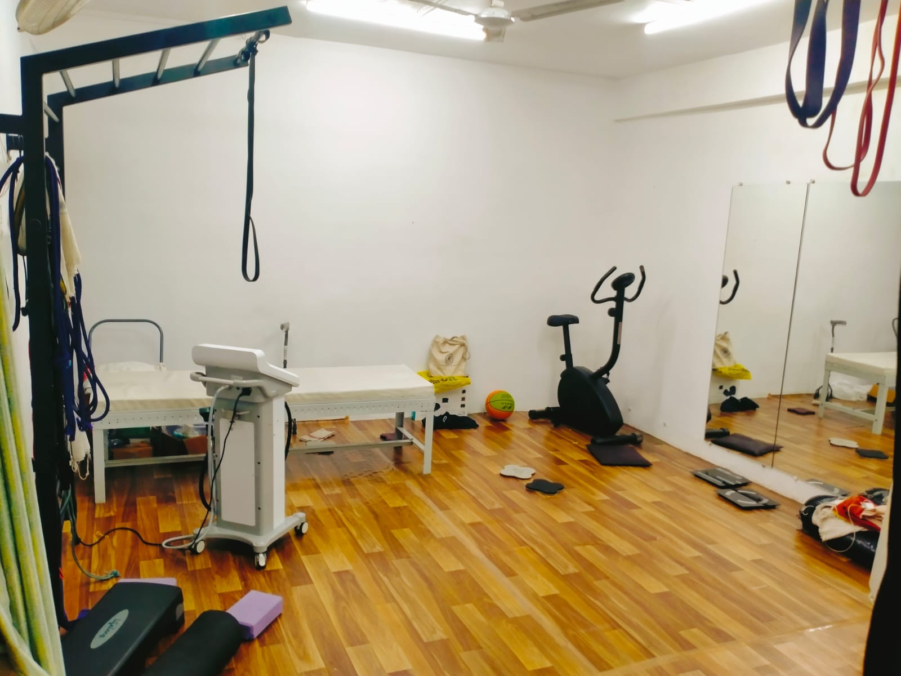

# RK Fusion Chiropractic Yog Centre Website

A premium 3D animated wellness website for **RK Fusion Chiropractic Yog Centre**, designed to combine chiropractic care, yoga therapy, and a calm modern visual experience.

## Project Overview

This project is a static front-end website built with:

- HTML5
- CSS3
- JavaScript
- Three.js for the 3D animated background

The website includes:

- 3D animated spine-inspired background
- Hero section with call-to-action
- About section
- Owner / practitioner section
- Services section
- Floating swipe gallery
- Testimonials section
- Contact section with Google Maps embed
- WhatsApp click-to-chat integration
- Footer credit with GitHub link
- Open Graph social sharing support

## Project Structure

```text
project-folder/
├── index.html
├── styles.css
├── main.js
└── assets/
    ├── logo-rk-fusion.png
    ├── owner.jpg
    ├── centre-1.jpg
    ├── centre-2.jpg
    ├── centre-3.jpg
    ├── centre-4.jpg
    └── og-rk-fusion.png
```

## Features

### 1. 3D Animated Background
- Built using Three.js.
- Uses a stylized spine made from vertebra-like segments.
- Includes breath-wave ribbons, floating particles, and smooth mouse / scroll interaction.

### 2. Branding
- Custom logo support through `assets/logo-rk-fusion.png`.
- Footer credit: `Made By: Babamosie333`.
- GitHub profile link included.

### 3. Owner Section
- Add a practitioner / owner photo with supporting text.
- Image path: `assets/owner.jpg`

### 4. Floating Swipe Gallery
- Horizontally scrollable photo gallery.
- Designed to feel light and floating with animation.
- Add more images by duplicating gallery cards in `index.html`.

### 5. Google Maps Integration
- Embedded directly above the contact details in the Contact section.
- Uses Google Maps iframe embed URL.

### 6. WhatsApp Integration
- Hero WhatsApp button opens a predefined message.
- Contact section WhatsApp link opens another predefined message.
- Contact form sends user details into WhatsApp using a prefilled message.

### 7. Open Graph Image
- Social preview image supported through `assets/og-rk-fusion.png`.
- Used in meta tags for better sharing on WhatsApp, Facebook, LinkedIn, and X.

## Setup Instructions

### 1. Add your files
Place these files in your project folder:

- `index.html`
- `styles.css`
- `main.js`

Create an `assets` folder and add:

- logo image
- owner photo
- gallery photos
- Open Graph image

### 2. Update Google Maps embed
In `index.html`, find this line:

```html
src="YOUR_GOOGLE_MAPS_EMBED_URL"
```

Replace it with your real Google Maps embed URL.

### 3. Update Open Graph URL
In `index.html`, replace:

```html
https://your-domain-here.com/
```

with your actual live website URL.

### 4. Run the project
Because this is a static website, you can run it by:

- opening `index.html` in a browser, or
- using VS Code Live Server, or
- deploying to Replit / Vercel / Netlify / GitHub Pages

## How to Add More Photos

### Add more gallery images
In `index.html`, duplicate this block inside the gallery section:

```html
<article class="gallery-card">
  
</article>
```

Then change the image file name:

```html
<article class="gallery-card">
  
</article>
```

Also place the new image file inside the `assets` folder.

### Recommended image naming
Use simple names like:

- `centre-1.jpg`
- `centre-2.jpg`
- `centre-3.jpg`
- `centre-4.jpg`
- `centre-5.jpg`

### Recommended image sizes
For better performance:

- Logo: PNG, around 300×300
- Owner photo: JPG/WebP, around 800×1000
- Gallery images: JPG/WebP, around 1200×800
- Open Graph image: PNG/JPG, exactly 1200×630

Compress large images before uploading for faster loading.

## WhatsApp Customization

In `main.js`, you can edit these predefined messages:

- Hero WhatsApp message
- Contact link message
- Contact form message template

Look for:

```js
const WHATSAPP_NUMBER = "919415043595";
```

and update the message strings below it if needed.

## Customization Ideas

You can improve the website further by adding:

- Light / dark mode toggle
- Testimonial slider animation
- Auto-scrolling gallery
- Before / after transformation section
- FAQ section
- Online booking form
- Instagram feed
- More practitioner details and certifications
- Animated counters
- Custom favicon
- Loading screen

## Deployment Options

You can host this project for free on:

- GitHub Pages
- Netlify
- Vercel
- Replit

## Credits

Website made for:  
**RK Fusion Chiropractic Yog Centre**

Location:  
**Swaroop Nagar, Kanpur, Uttar Pradesh**

Contact:  
**+91 94150 43595**

Made By:  
**Babamosie333**

GitHub:  
https://github.com/Babamosie333
```